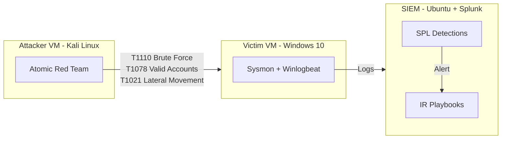

# 🛡️ SOC Incident Response Simulation Lab

> **A home-built SOC range where I break things on purpose — so I can defend them at work.**

A reproducible home SOC lab **design** on **VirtualBox** with a **Splunk** SIEM at its core — example **SPL detection rules** and **incident response playbooks** mapped to **MITRE ATT&CK**, plus a step-by-step guide to build and validate it yourself. A portfolio reconstruction based on my 2025 SOC simulation project.

## 🏗️ Lab architecture



| Component | Role |
|-----------|------|
| **Kali Linux** (attacker) | Runs Atomic Red Team adversary simulations |
| **Windows 10** (victim) | Sysmon + Winlogbeat forward security logs |
| **Ubuntu + Splunk** (SIEM) | Central log ingestion, SPL detections, alerting |

## 📁 What's inside

```
├── setup-guide.md              # Step-by-step lab build (VirtualBox → Splunk → log forwarding)
├── detections/
│   ├── brute_force.spl         # T1110 — password spraying / guessing
│   ├── privilege_escalation.spl# T1068 / T1134 — suspicious privesc behavior
│   └── lateral_movement.spl    # T1021 — PsExec / WinRM / RDP lateral movement
├── atomic-red-team/
│   └── mitre_mapping.md        # Every simulated technique → detection → ATT&CK ID
└── playbooks/
    ├── phishing_response.md    # End-to-end phishing triage & containment
    └── malware_containment.md  # Endpoint isolation & eradication runbook
```

## 🎯 Detection coverage

| # | Scenario | ATT&CK | Covered by |
|---|----------|--------|------------|
| 1 | Brute force against RDP/SSH | **T1110.001** | `brute_force.spl` |
| 2 | Privilege escalation via token manipulation | **T1134** | `privilege_escalation.spl` |
| 3 | Lateral movement via PsExec / WinRM | **T1021.004 / T1021.006** | `lateral_movement.spl` |

Validate each detection in your own lab by executing the matching Atomic Red Team technique from [`atomic-red-team/mitre_mapping.md`](atomic-red-team/mitre_mapping.md) and confirming the SPL fires.

## 🚀 Reproduce it

Full build instructions in [`setup-guide.md`](setup-guide.md). TL;DR:

1. Create 3 VirtualBox VMs (Kali, Windows 10, Ubuntu) on a host-only network
2. Install Splunk Enterprise (free trial) on Ubuntu, open port 9997
3. Install Sysmon + Winlogbeat on Windows, forward to Splunk
4. Install Atomic Red Team on Kali: `Install-AtomicRedTeam.ps1` / `install.sh`
5. Execute a technique, e.g. `Invoke-AtomicTest T1110 -TestNumbers 1`
6. Load the SPL in `detections/` and test it against the scenario

## 🧠 What this taught me

- Writing detections forces you to think like both attacker **and** defender
- A detection without a tuned threshold is just a false-positive generator
- Playbooks are what turn a 2 AM alert into a 20-minute response instead of a 2-hour panic

## 🛠️ Built with

`Splunk` `SPL` `Atomic Red Team` `MITRE ATT&CK` `VirtualBox` `Sysmon` `Kali Linux`

---

<p align="center"><i>Built by <a href="https://github.com/anushniranchan-cyber">Anush Niranchan Anandh</a> — Security Operations Analyst 🛡️</i></p>
